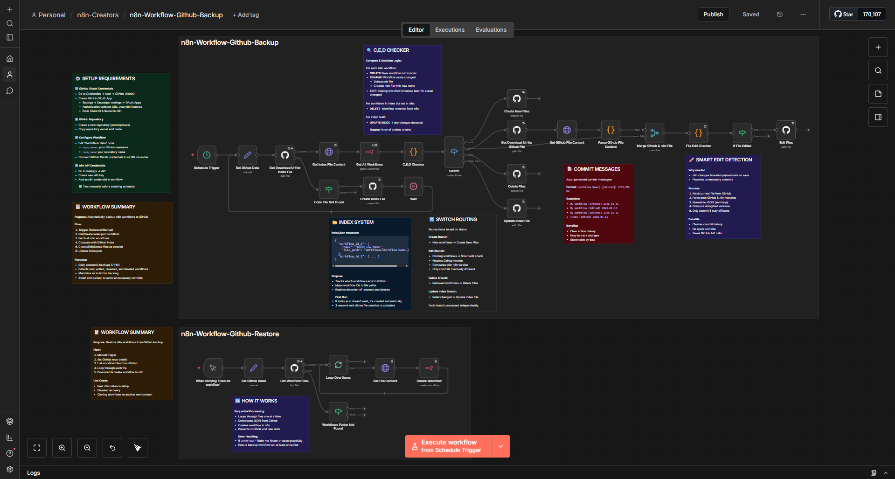

# n8n Workflows GitHub Manager

> A comprehensive **n8n workflow** that provides complete bidirectional sync between your n8n instance and GitHub - automatically backs up all your workflows with intelligent change detection AND restores them when needed.


This workflow combines two powerful features in one:
* **Backup**: Automatically detects new, edited, renamed, and deleted workflows in your n8n instance, then syncs them to GitHub with smart commit messages and an index tracking system.
* **Restore**: Easily restore all workflows from your GitHub repository back to n8n - perfect for disaster recovery, new instance setup, or environment cloning.



---

## How It Works

### 🔄 Backup Mode (Automatic)

1. **Trigger**: Runs automatically every day at 7 PM UTC (or manually when triggered via the Schedule Trigger).
2. **Get/Create Index**: Attempts to fetch `index.json` from your GitHub repository.
   * **If found** → Downloads and parses it.
   * **If not found** → Creates a new empty index file and waits 3 seconds for GitHub to process.
3. **Fetch All Workflows**: Retrieves all workflows from your n8n instance via the n8n API.
4. **Smart Comparison**: The "C,E,D Checker" (Create, Edit, Delete) analyzes differences:
   * **CREATE** → New workflow not in index.
   * **RENAME** → Workflow name changed (deletes old file, creates new one).
   * **EDIT** → Existing workflow (flagged for content comparison).
   * **DELETE** → Workflow removed from n8n but still in GitHub.
   * **INDEX UPDATE** → Triggered if any changes detected.
5. **Route Actions**: Switch node routes each action to the appropriate branch:
   * **Create Branch** → Creates new workflow files in GitHub.
   * **Edit Branch** → Performs smart edit detection:
     * Fetches current file from GitHub.
     * Compares GitHub version vs. n8n version (normalized JSON).
     * **Only commits if content actually changed** (avoids timestamp-only updates).
   * **Delete Branch** → Removes workflow files from GitHub.
   * **Update Index Branch** → Updates `index.json` with latest mappings.
6. **Commit Messages**: Auto-generated with format: `[Workflow Name] (Action) YYYY-MM-DD`

### ⬇️ Restore Mode (Manual)

1. **Trigger**: Manually execute via the "When clicking 'Execute workflow'" manual trigger.
2. **Set GitHub Details**: Configure your repository owner and name.
3. **List Workflow Files**: Fetches all workflow JSON files from the `workflows/` folder in your GitHub repository.
   * **If folder not found** → Workflow stops gracefully (ensure backup ran at least once first).
4. **Loop Through Files**: Sequentially processes each workflow file:
   * Downloads the JSON content from GitHub.
   * Creates the workflow in your n8n instance via the n8n API.
5. **Sequential Processing**: Handles one workflow at a time to prevent conflicts and respect rate limits.
6. **Result**: All workflows from GitHub are restored to your n8n instance.

---

## Requirements

* **GitHub OAuth2 Credentials**:
  * Go to [GitHub Developer Settings](https://github.com/settings/developers) → OAuth Apps → New OAuth App.
  * Set **Authorization callback URL** to your n8n instance URL (e.g., `https://your-n8n.com/rest/oauth2-credential/callback`).
  * Copy **Client ID** and **Client Secret**.
  * Add as OAuth2 credential in n8n (*Credentials → New → GitHub OAuth2*).

* **GitHub Repository**:
  * Create a new repository (public or private).
  * Note your **username** (repo owner) and **repository name**.

* **n8n API Credentials**:
  * In your n8n instance → *Settings → API* → Create new API key.
  * Add as n8n API credential in the workflow.

---

## How to Use

### Initial Setup

1. **Import the Workflow**:
   * Copy the provided JSON file.
   * In your n8n instance → click **Import Workflow** → paste or upload the JSON.

2. **Create GitHub Repository**:
   * Go to GitHub → Create a new repository (e.g., `n8n-workflows-manager`).
   * Leave it empty (no README, no .gitignore).

3. **Set Up GitHub OAuth2**:
   * In n8n → *Credentials → New → GitHub OAuth2*.
   * Fill in:
     * **Client ID** → from GitHub OAuth App.
     * **Client Secret** → from GitHub OAuth App.
   * Click **Connect my account** and authorize.

4. **Set Up n8n API Credentials**:
   * In n8n → *Settings → API* → Create new API key.
   * Copy the key.
   * In workflow → *Credentials → New → n8n API* → paste the key.
   * Set **Base URL** to your n8n instance (e.g., `https://your-n8n.com`).

5. **Configure Repository Details**:
   * Find **both** "Set Github Data" nodes in the workflow (one for backup, one for restore).
   * Edit the assignments in each:
     * `repo_owner`: Replace `"your-github-username"` with your GitHub username.
     * `repo_name`: Replace `"your-github-repository-name"` with your repository name.

6. **Connect Credentials to Nodes**:
   * Open each **GitHub node** (there are 8 total):
     * **Backup section**: Create Index File, Get Download Url for Index File, Create New Files, Update Index File, Get Download Url for Github File, Delete Files, Edit Files
     * **Restore section**: List Workflow Files
   * Set **Credential for GitHub OAuth2** to the one you created.
   * Open the **n8n API nodes** (Get All Workflows, Create Workflow) → Set **Credential for n8n API** to the one you created.

### Using Backup Mode

7. **Test Backup**:
   * Click the **"Schedule Trigger"** node at the top of the workflow.
   * Click **"Test workflow"**.
   * Monitor execution → All nodes in the backup section should turn green.
   * Check your GitHub repository → Should see `index.json` and `workflows/` folder with your workflows.

8. **Activate for Auto Backup**:
   * Once tested successfully, toggle the workflow to **Active**.
   * It will now run automatically every day at 7 PM UTC.

### Using Restore Mode

9. **Test Restore** (only after you have backups in GitHub):
   * Click the **"When clicking 'Execute workflow'"** manual trigger node at the bottom.
   * Click **"Test workflow"**.
   * Monitor execution → All nodes in the restore section should turn green.
   * Check your n8n workflows list → All workflows from GitHub should now be present.

10. **When to Use Restore**:
    * Setting up a new n8n instance.
    * Recovering after data loss.
    * Cloning workflows to another environment.
    * Rolling back to a previous state (manually download older commits from GitHub first).

---

## Notes

### Backup Mode Notes

* **Smart Edit Detection**:
  * The workflow uses normalized JSON comparison to avoid unnecessary commits.
  * n8n often changes internal timestamps/metadata when workflows are opened but not modified.
  * Only commits when actual workflow logic/configuration changes.

* **Index System**:
  * `index.json` maps workflow IDs to file paths and names:
    ```json
    {
      "workflow_id_abc123": {
        "name": "My Workflow",
        "file_path": "workflows/My Workflow.json"
      }
    }
    ```
  * Enables detection of renames and deletions.
  * Updates automatically when changes occur.

* **File Structure in GitHub**:
  ```
  your-repo/
  ├── index.json
  └── workflows/
      ├── Workflow Name 1.json
      ├── Workflow Name 2.json
      └── Workflow Name 3.json
  ```

* **Rename Handling**:
  * When a workflow is renamed, the old file is deleted and a new file is created.
  * Two commits will appear: one for deletion, one for creation.

* **Commit Message Format**:
  * Created: `Workflow Name (Created) 2026-01-15`
  * Edited: `Workflow Name (Edited) 2026-01-15`
  * Deleted: `Workflow Name (Deleted) 2026-01-15`
  * Index: `Index (Edited) 2026-01-15`

* **Pinned Data**:
  * The workflow automatically excludes pinned data from backups (set in "Get All Workflows" node).

* **Error Handling**:
  * If index.json doesn't exist on first run, it's created automatically.
  * All GitHub nodes have "Retry on Fail" enabled.
  * Continue on error is enabled for index file lookup.

### Restore Mode Notes

* **Workflow Creation**:
  * Restored workflows are created as **new workflows** with new IDs.
  * They are created in **inactive** state by default.
  * Credentials must be reconnected manually after restore.

* **Sequential Processing**:
  * The "Loop Over Items" node processes workflows one at a time.
  * Prevents race conditions and respects n8n API rate limits.
  * For large numbers of workflows, this may take several minutes.

* **Prerequisites**:
  * The `workflows/` folder must exist in GitHub (created by first backup run).
  * If restore is triggered before any backup, it will stop gracefully.

* **Credential Handling**:
  * Workflow JSON includes credential **IDs** but not actual credential data.
  * After restore, you must:
    * Recreate credentials in the new instance, OR
    * Map old credential IDs to new ones, OR
    * Manually reconnect credentials in each restored workflow.

* **Duplicate Workflows**:
  * If you restore to the same instance where workflows already exist, you'll get **duplicates**.
  * Consider deleting existing workflows first, or use this feature intentionally for cloning.

* **Active vs Inactive**:
  * Backup preserves the workflow state (active/inactive) in JSON.
  * However, restore creates workflows in inactive state.
  * You'll need to manually activate them as needed.

### General Notes

* **Two Independent Workflows in One**:
  * This is technically a single n8n workflow with two separate execution paths.
  * Backup path triggers automatically (Schedule Trigger).
  * Restore path triggers manually (Manual Trigger).
  * They share GitHub and n8n API credentials but operate independently.

* **Version Control Benefits**:
  * GitHub provides full version history for all workflows.
  * You can view diffs, roll back changes, and track who modified what.
  * Use GitHub's web interface to browse workflow history.

* **Security Considerations**:
  * Workflow JSON may contain sensitive data in node parameters.
  * Consider using a **private repository** for backups.
  * Credential secrets are NOT included in backups (only credential IDs).
  * Be cautious with workflow names if they contain sensitive information.

---

## Example Behavior

### Backup Mode Examples

* **Day 1 (First Backup Run)**:
  * Workflow triggers at 7 PM → No index.json found → Creates index.json.
  * Fetches 5 workflows from n8n → All marked as "CREATE".
  * Commits 6 files: `index.json` + 5 workflow files.

* **Day 2**:
  * You create 1 new workflow, edit 1 existing workflow, rename 1 workflow.
  * Workflow triggers at 7 PM → Detects changes:
    * 1 CREATE (new workflow).
    * 1 DELETE + 1 CREATE (rename).
    * 1 EDIT → Compares content → Different → Commits.
    * INDEX UPDATE.
  * Commits: 5 total (1 create, 1 delete, 1 create, 1 edit, 1 index update).

* **Day 3**:
  * You open a workflow but don't change anything (n8n updates internal timestamp).
  * Workflow triggers at 7 PM → Detects 1 EDIT candidate.
  * Fetches GitHub version → Compares normalized JSON → **Identical**.
  * **No commit made** (smart detection prevents spam).
  * Only INDEX is checked → Unchanged → **Workflow completes with 0 commits**.

* **Day 4**:
  * You delete 2 workflows from n8n.
  * Workflow triggers at 7 PM → Detects 2 DELETE + INDEX UPDATE.
  * Commits: 3 total (2 deletions, 1 index update).

### Restore Mode Examples

* **New Instance Setup**:
  * You set up a fresh n8n instance on a new server.
  * Configure GitHub credentials and repository details in the restore section.
  * Manually trigger the restore workflow.
  * All workflows from your GitHub backup are recreated in the new instance.

* **Disaster Recovery**:
  * Your n8n database is corrupted or accidentally deleted.
  * After fixing the instance, trigger the restore workflow.
  * All workflows are restored from GitHub to their last backed-up state.

* **Environment Cloning**:
  * You want to copy production workflows to a staging environment.
  * Point the restore workflow to the production backup repository.
  * Manually trigger restore → All production workflows are cloned to staging.

* **Selective Restore**:
  * You accidentally deleted a workflow and want only that one back.
  * Go to GitHub → Download the specific workflow JSON.
  * Manually import just that workflow in n8n (or modify restore to target specific files).

---

## Customization

### Backup Mode Customizations

* **Change Backup Schedule**:
  * Edit the **"Schedule Trigger"** node → modify `triggerAtHour` (currently `19` for 7 PM UTC).
  * Can also change to run weekly, monthly, etc.

* **Change File Storage Path**:
  * Modify `filePath` in GitHub nodes to store workflows in a different location (e.g., `backups/{{ $json.name }}.json`).
  * Update the restore workflow's "List Workflow Files" node to match the new path.

* **Add Repository Documentation**:
  * You can add a step to create/update a README.md in your GitHub repo with backup metadata.
  * Include information like last backup date, number of workflows, etc.

* **Notification on Changes**:
  * Add a "Send Email" node at the end of the backup section to notify you when backups complete.
  * Connect after the final GitHub nodes with a summary of changes.
  * Example: "Backed up 3 new workflows, edited 2, deleted 1".

* **Multiple Repositories**:
  * Duplicate the workflow and change `repo_name` in "Set Github Data" to backup to different repos.
  * Useful for separating production vs. development workflows.

### Restore Mode Customizations

* **Selective Restore**:
  * Modify the "List Workflow Files" node to filter specific workflows by name pattern.
  * Add an IF node to skip certain workflows during restore.

* **Webhook Trigger for Restore**:
  * Replace the manual trigger with a webhook trigger.
  * Allows remote triggering of restore (e.g., from CI/CD pipelines).

* **Pre-Restore Backup**:
  * Add a step before restore to backup current n8n state first.
  * Provides safety net before overwriting existing workflows.

* **Post-Restore Activation**:
  * Add an n8n node after "Create Workflow" to automatically activate restored workflows.
  * Currently workflows are restored in inactive state.

* **Conflict Handling**:
  * Add duplicate detection before creating workflows.
  * Option to skip, overwrite, or rename conflicting workflows.

---

**Author:** Muhammad Anas Farooq
